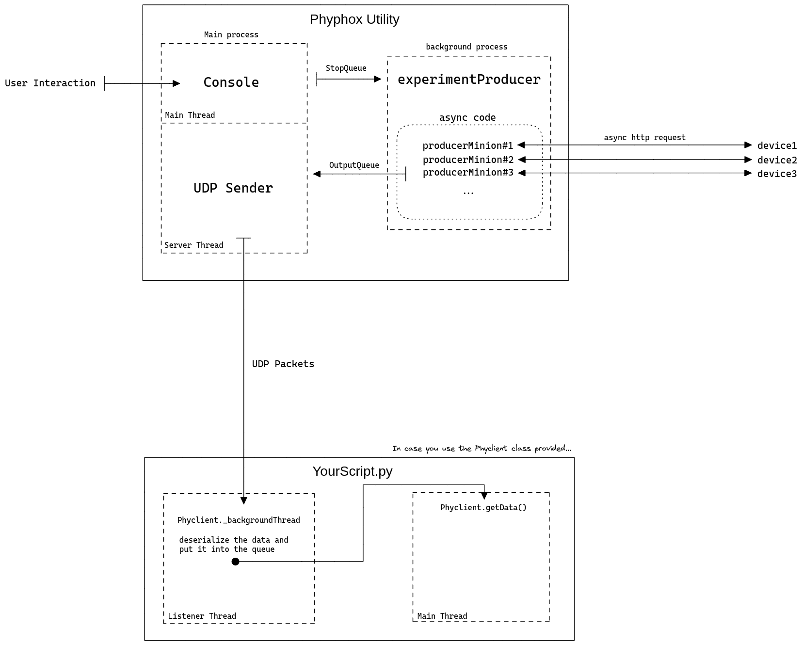
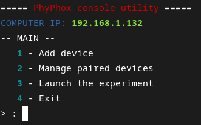
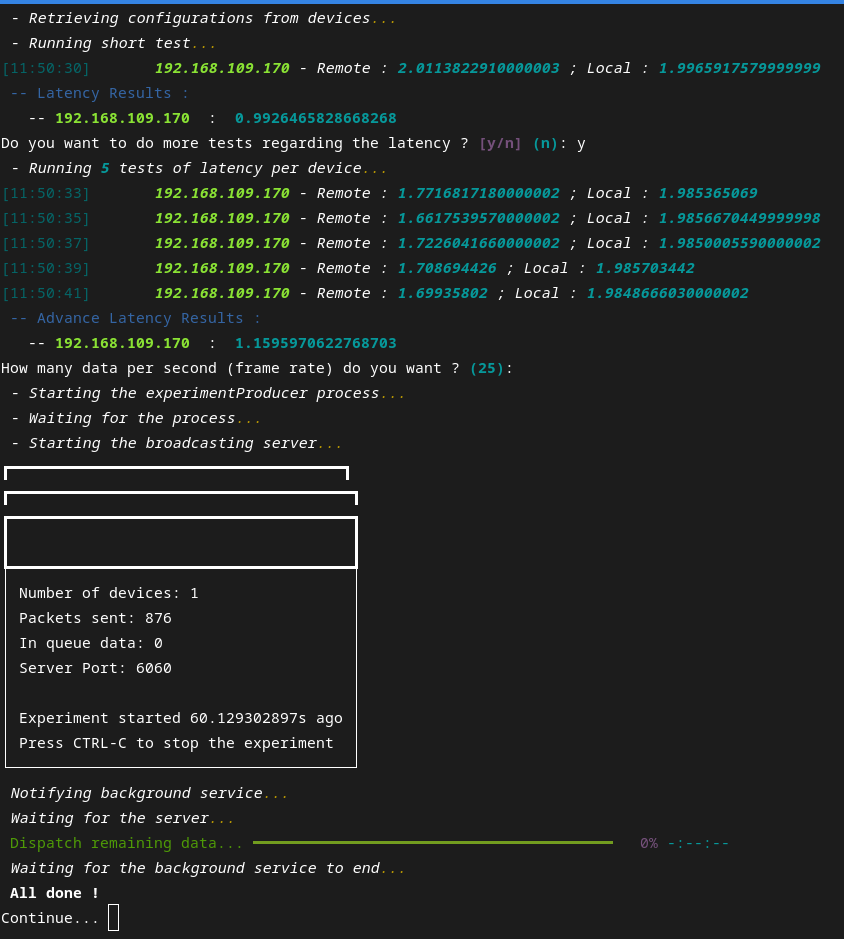

# Phyphox Utility

This project aims to simplify the usage of the Phyphox API to let you focus on data study.
The script will handle the connection with your phones and the data gathering from them and pass it to your script through UDP protocol.

## How does it work?

Because latency is significant, I tried to minimize it by using threading, multiprocessing, and async code (yeah, I don't think it was necessary to use all of this, I will undoubtedly make some changes in the future)
For now, it's working as it is with pretty good performances, even if I noticed a time gap between the python script clock and the devices, for which I will have to address a patch.

Because a picture says more than a thousand words, here is a sketch of how the script is working:



## Screenshots





## Run Locally

Clone the project

```bash
  git clone https://github.com/devdl11/phyphox-tool
```

Go to the project directory

```bash
  cd phyphox-tool
```

Install dependencies

```bash
  python3 -m pip install -r requirements.txt
```

Start the script

```bash
  python3 main.py
```

After you started the script, run your script in a different terminal and you are ready to go!

For example, let's start the printer.py:
```bash
  cd examples
  python3 printer.py
```

## Lessons Learned

This project was the occasion for me to learn more about async code, and the main differences between threads, async, and multiprocessing, especially in python with the GIL.
There is still a long way to go, but it was fun, and there are still some improvements. In conclusion: to be continued...
## Roadmap

- Fix the time gap issue

- Optimize the code

- Export the data after the experiment ends


## Authors

- [@devdl11](https://www.github.com/devdl11)


## License

[Mozilla Public License 2.0](https://choosealicense.com/licenses/mpl-2.0/)
